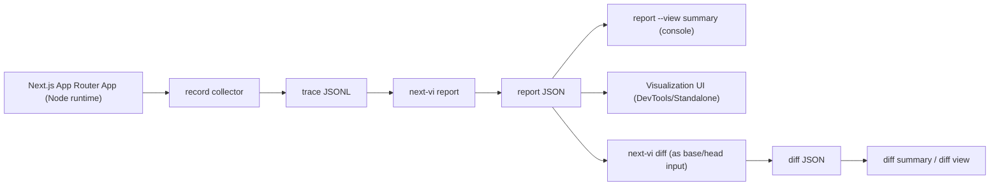
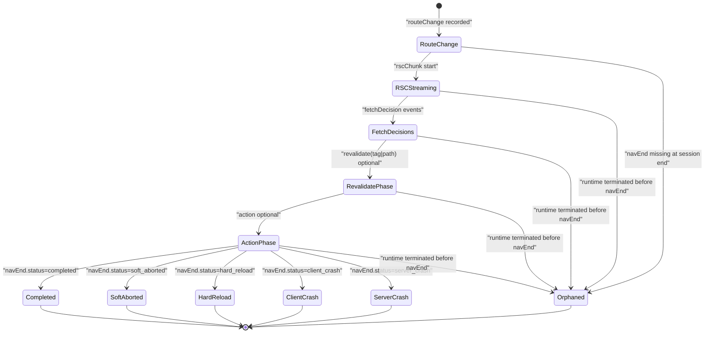
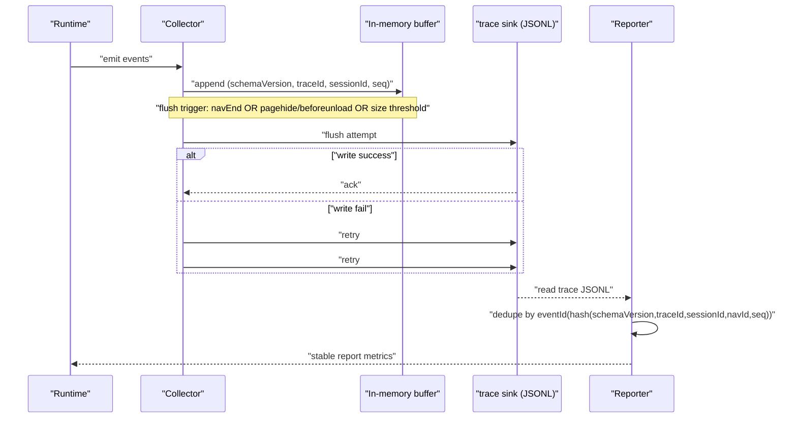
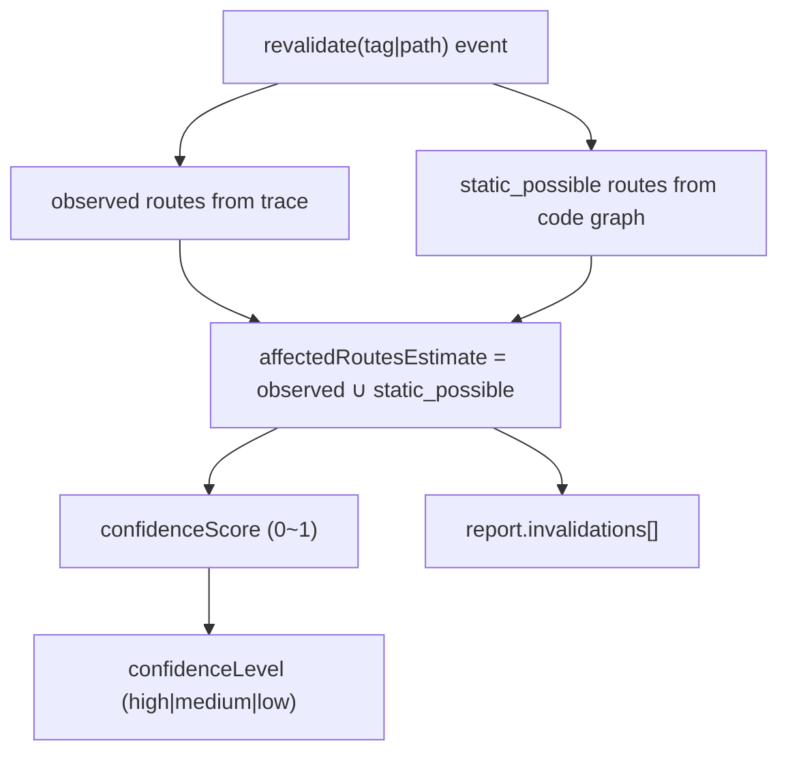
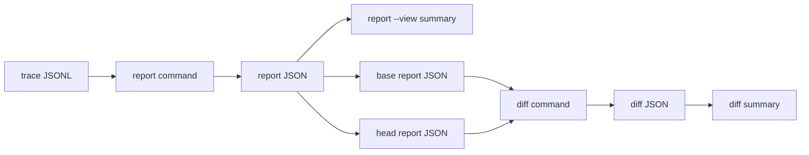
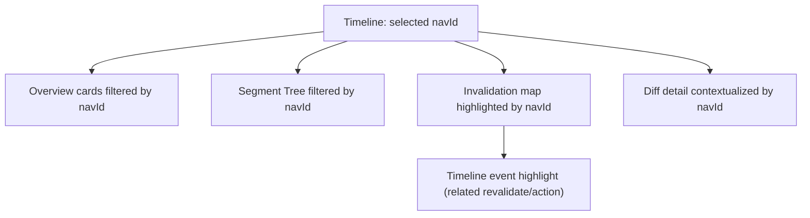

# Mermaid RFC: next-vi 시각화 다이어그램 모음

- Status: Draft
- Last Updated: 2026-02-17
- Parent RFC: `./cli-rfc.md`
- Technical RFC: `./technical-rfc.md`
- Commands RFC: `./commands-rfc.md`
- Visualization RFC: `./visualization-rfc.md`
- Terms: `./terms.md`

## 1. Summary

본 문서는 next-vi의 핵심 동작을 Mermaid 다이어그램으로 고정한다.  
목적은 RFC 간 텍스트 해석 차이를 줄이고, 구현 전/후 동작 검증 기준을 통일하는 것이다.

## 2. 렌더링 방법

- GitHub Markdown 렌더 또는 VS Code Markdown Preview 사용
- Mermaid 미표시 시 VS Code 확장(`Markdown Preview Mermaid Support`) 사용

## 3. End-to-End 데이터 흐름

## 4. Navigation 상태 전이 (`navEnd` 포함)

## 5. Flush/Retry/Dedupe 동작

## 6. 영향도 계산 (`revalidate(tag|path)`)

## 7. Report/Diff 처리 흐름

## 8. 탭 간 상호작용 동기화

## 9. 다이어그램 검토 체크리스트

- `trace -> report -> diff` 입력/출력 타입이 RFC와 일치하는가
- `navEnd.status`와 `orphaned` 경로가 용어 정의와 일치하는가
- retry(최대 3회) + dedupe(eventId)가 같은 그림 안에서 모순 없이 표현되는가
- 영향도 계산식이 `observed ∪ static_possible`로 고정되어 있는가
